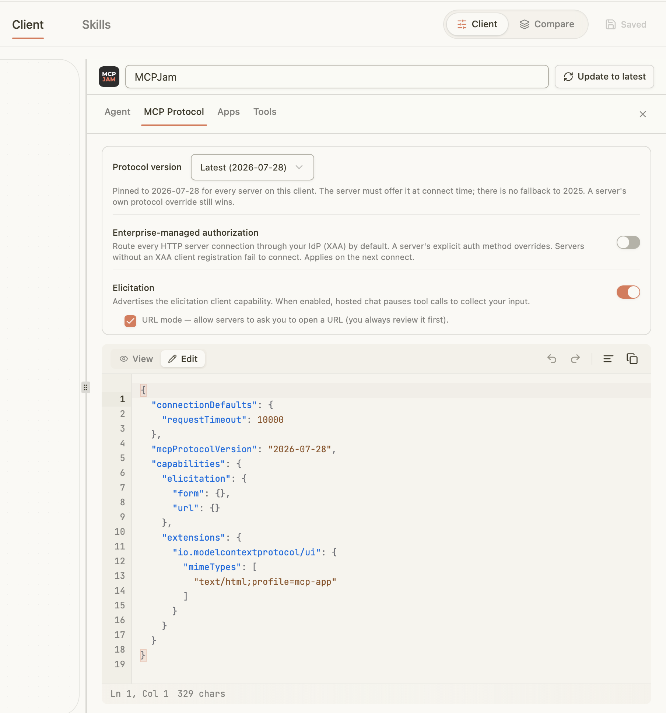
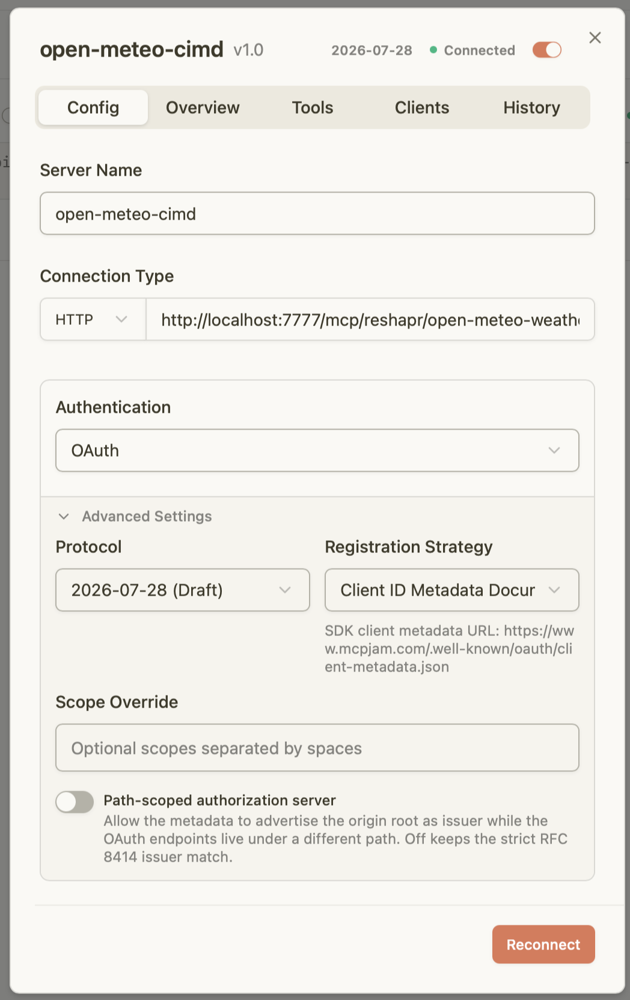

## How to run an OAuth CIMD + ELicitation test? 

You can go directly o step 2 if you don't need the configuration details.

### 1st step: prepare a Keycloak instance with CIMD support

In this first step, we're only doing a local setup with a Keycloak instance for a configuration test.
CIMD support is a feature preview in Keycloak `26.6.0` and documentation is not available yet.

#### Serve the metadata document

Start the local HTTP server for the metadata document:
```shell
python3 -m http.server 8000
```

#### Keycloak Configuration

Make the (not yet available) Keycloak instance available in HTTPS by using `ngrok`:
```shell
ngrok http 8888
```

This will provide this kind of output from where you should extract the forwarding url:

```shell
▶️ ngrok is way mores than tunnels to localhost. https://ngrokhq.link/video                                                                                                       
                                                                                                                                                                                 
Session Status                online                                                                                                                                             
Account                       Laurent Broudoux (Plan: Free)                                                                                                                      
Update                        update available (version 3.39.10, Ctrl-U to update)                                                                                               
Version                       3.37.6                                                                                                                                             
Region                        Europe (eu)                                                                                                                                        
Latency                       30ms                                                                                                                                               
Web Interface                 http://127.0.0.1:4040                                   
Forwarding                    https://unvibrating-uncondoned-jessia.ngrok-free.dev -> http://localhost:8888                       
```

Collect this forwarding url and edit the `../dev/start-keycloak-docker.sh`, replacing line 25 with adapter line 26.

Then run `../dev/start-keycloak-docker.sh` to start a local Keycloak instance on http://localhost:8888

Now checking the configuration of the different Keycloak realms (connect to the local Keycloak using `admin`/`admin`):

**Realm `3rdparty`**

Check the `cimd-profile` in realm configuration:
* Executor: `client-id-metadata-document`
  * Allow http scheme: ON
  * Trusted domains:
    * `host.docker.internal` for the `client_id` itself
    * `localhost` for the `redirect_uris` declaration

Check the `cimd-policy` in realm configuration:
* Condition: `client-id-uri`
  * URI scheme: `http`
  * Trusted domains:
    * `*.docker.internal` for the `client_id` itself
* Profile: `cimd-profile`

#### Test in a browser

You should be able to authent using `laurent`/`laurent`:

https://unvibrating-uncondoned-jessia.ngrok-free.dev/realms/3rdparty/protocol/openid-connect/auth?client_id=http://host.docker.internal:8000/metadata.json&response_type=code&redirect_uri=http://localhost:8000/callback&scope=openid

## 2nd step: Run the full demonstration

### Pre-requisites

* Have the Keycloak instance running (`../dev/start-keycloak-docker.sh`)
* Have a Ngrok tunnel running (`ngrok http 8888`)
* Have a Reshapr control plane + gateway running

### Load the Open Meteo with Elicitation example

Check the `elicitation-example.sh` and adapt the `NGROK_ALIAS` value to your local ngrok tunnel.

Execute `./elicitation-example.sh`:
```shell
$ ./elicitation-example.sh
==== OUTOUT ====
ℹ️  Logging in to Reshapr at http://localhost:5555...
✅ Login successful!
ℹ️  Welcome, admin!
✅ Configuration saved to /Users/laurent/.reshapr/config
ELICITATION_ID: 0R6HJ6HVJVV8R
SERVICE_ID: 0R6HJ6M2AVVEG
CONFIGPLAN_ID: 0R6HJ6MWTVVFM
✅ Exposition created successfully with ID: 0R6HJ6NKEVVDY
ℹ️  Exposition details
ID          : 0R6HJ6NKEVVDY
Name        : open-meteo-weather-forecast-api-1-0-with-elicitation
Created on  : 2026-08-03T12:33:42.555569+02:00
Organization: reshapr
Service:
  ID     : 0R6HJ6M2AVVEG
  Name   : Open-Meteo Weather Forecast API
  Version: 1.0
  Type   : REST
Configuration Plan
  ID                : 0R6HJ6MWTVVFM
  Name              : with-elicitation
  BackendEndpoint   : https://api.open-meteo.com
  Included Ops.     : []
  Excluded Ops.     : []
  Included Artifacts: all attached artifacts
Gateway Group
  ID    : 1
  Name  : Default Gateway Group
  Labels: {"env":"dev","team":"reshapr"}
Gateway Endpoints
  - ID       : 0R6HJ44YTVTZX
    Name     : reshapr-gateway-00
    Endpoints: localhost:7777/mcp/0R6HJ6NKEVVDY, localhost:7777/mcp/reshapr/open-meteo-weather-forecast-api-1-0-with-elicitation
```

### Configure MCPJam client

First, check the MCP Client configuration in MCPJam. You should have elicitations enabled with URL mode supported like below:



Then create a new connection for this `open-meteo-cimd` configuration:




### Run the CIMD Elicitation!


